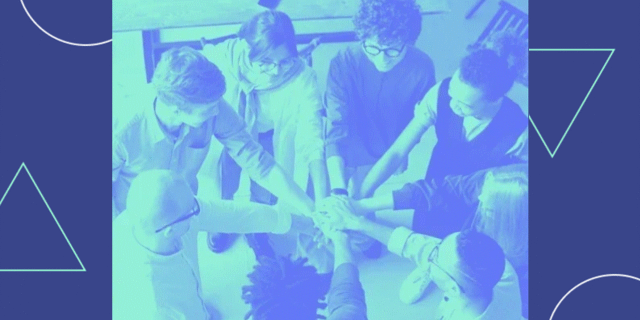

  

# Projeto de curso ReactJS da Alura: Organo

Olá! Este projeto foi desenvolvido durante o curso "React: desenvolvendo com JavaScript", da Alura, do Vinicius Neves e Paulo Silveira.

## Diferenças

O projeto do curso, se seguido estritamente, seria projetado apenas para desktops e utilizaria 5 instrutores, copiados em cada seção.
Querendo fazer um projeto mais completo e utilizar os meus conhecimentos obtidos nos outros cursos, eu fiz as seguintes mudanças:

- `Design Responsivo`: O site pode ser utilizado completamente em mobile, tablet, desktop ou telas grandes;
- `Edição de Imagens`: Banner mobile e certos ícones UI foram criados, além da utilização de formatos performáticos (svg e webp);
- `Acessibilidade`: Certas mudanças, como aumento de contraste e área clicável foram melhorados;
- `Modo Noturno`: Um botão para modo noturno foi adicionado para usuários que quiserem;
- `Lista Completa`: Todos os instrutores, com algumas exceções, foram utilizados no projeto;
- `Funcionalidades`: O formulário pode ser ocultado, e a lista de instrutores pode ser expandida, melhorando performance;
- `Score Perfeito`: Um score perfeito de Performance, Acessibilidade, Melhores Práticas e SEO foi obtido (Lighthouse);

## Ferramentas Utilizadas

- `Paint.net`: Utilizado para criar e editar imagens raster;
- `Inkscape`: Utilizado para criar imagens vetoriais para UI e Background;
- `Puppeteer`: Utilizado para facilitar a construção da lista de instrutores, usando a página pública "https://www.alura.com.br/instrutores";
- `ReactJS`: Foco do projeto, utilizado para criar a página;

## Agradecimentos

- `Alura`: Este projeto só foi possível através da plataforma da Alura, que proporcionou cursos de alta qualidade nas áreas
estudadas, no caso HTML, CSS, JavaScript nativo e ReactJS.
- `ChatGPT`: Utilizado para fins de estudo, para conceitos específicos.

## Licença

Não é permitido o uso de qualquer arquivo que possua origem na Alura, a menos que se obtenha permissão deles ou (acredito) que esses
arquivos sejam usados para projetos de curso da mesma. Para utilizar arquivos criados por mim, por favor peça permissão primeiro.

* Usuários permitidos: serão inseridos aqui... um dia, talvez.

## Bugs

- Se o usuário tentar adicionar um novo instrutor em uma categoria completamente expandida, esta categoria voltará ao
tamanho inicial de 5 instrutores, e o botão para expandir a lista não voltará.
